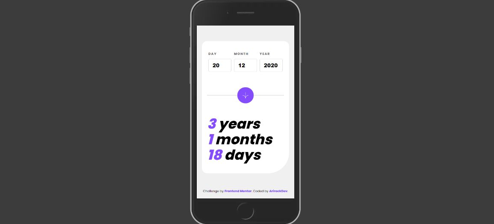
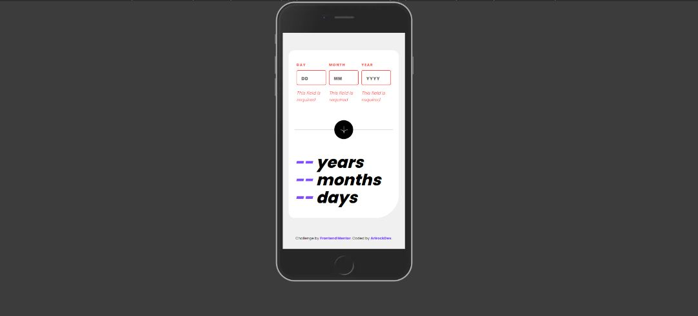
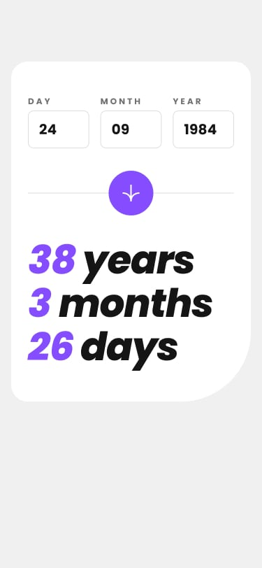
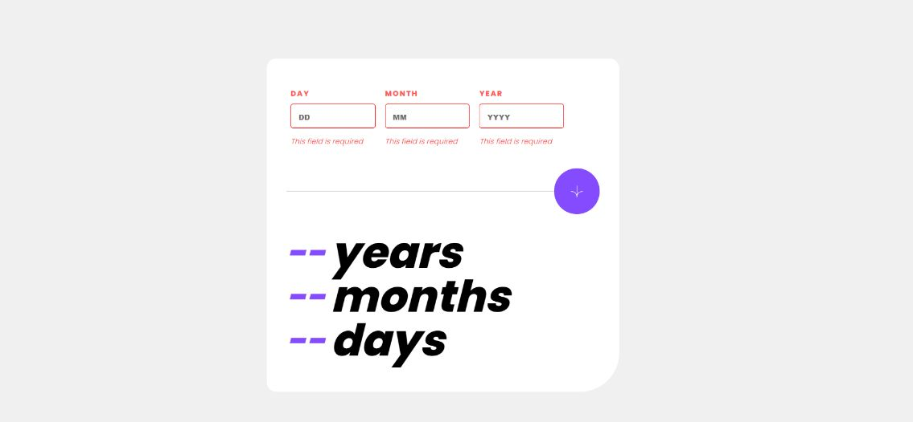

# Frontend Mentor - Age calculator app

## Welcome! 👋

  This is my solution for this challenge.

  In this age calculator app, i used html, css, and javascript.

## This is de link for the challenge deploy:
  [Age Calculator App](https://age-calculator-app-front.netlify.app/)

